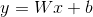
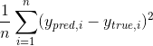

Linear regression and core concepts of machine learning
^^^^^^^^^^^^^^^^^^^^^^^^^^^^^^^^^^^^^^^^^^^^^^^^^^^^^^^
Basics of linear regression and loss functions
==============================================

| Speaking about machine learning, the best practice is to start with a basic simple algorithm and master core ideas using it. Before speaking about the particular model we are going to consider, you should understand that the key purpose of every machine learning model is to find a complex function that will do the compex stuff implied by the data. The classifier we will speak about is called *linear regression*.  As the name implies this model is used for regression and the function it tries to learn is a linear one. The mathematical view of this function is the following : 

| Here y - is a predicted discreate number, x - is a feature, W and b - parameters which the model tries to learn (they actually represent the templates learned by model to make different decisions). If we have more than one feature, for example to predict the house's price we have not just the number of rooms, but also the distance to the center to the city, the equation above will transform to this view : 
.. image:: linearform2.png
  :width: 150
  :alt:  Linear regression formula

| We now understand where x (feature) is used, but we also have a real y, what is an aim of this thing? Actually to understand which parameters to choose our model needs to somehow measure if the predicted y is close to the real one, it needs to learn if it's wrong or right, and if it's wrong the model should continue learning to understand the gist better and calculate new better parameters. That's the moment where such notation as *loss function* comes into the game. `The purpose of loss functions is to measure the perfomance of the model and help it understand made mistackes, and the purpose of the algorithm is to find such W and b parameters that minimize the loss function.` - this a core concept of machine learning that is used across the field. 
 
 .. note:: We won't dig into math of loss functions and optimization algorithms, but we hardly ecnourage you to take a look on `this <https://www.coursera.org/learn/machine-learning?>`_ course made by Andrew Ng. 

| How does a loss function look like? Well, loss functions can differ depending on the problem the classifier should solve, but for regression tasks we will consider the following :
MSE (Mean Squared Error): 

The intuition behind this loss function is in the fact that it makes big mistakes of our model bigger while small ones - smaller. 

.. image:: https://colab.research.google.com/assets/colab-badge.svg
  :target: https://colab.research.google.com/github/HikkaV/VNTU-ML-Courses/blob/master/assignments/machine_learning/assignment_1/assignment_1.ipynb
  :width: 150
  :alt:  Linear regression formula
