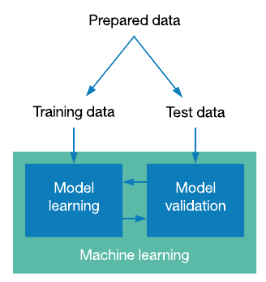

Linear regression and core concepts of machine learning
^^^^^^^^^^^^^^^^^^^^^^^^^^^^^^^^^^^^^^^^^^^^^^^^^^^^^^^
Basics of linear regression and loss functions
==============================================

| Speaking about machine learning, the best practice is to start with a basic simple algorithm and master core ideas using it. Before speaking about the particular model we are going to consider, you should understand that the key purpose of every machine learning model is to find a complex function that will do the compex stuff implied by the data. The classifier we will speak about is called *linear regression*.  As the name implies this model is used for regression and the function it tries to learn is a linear one. The mathematical view of this function is the following : 
.. image:: linearform.png
  :width: 150
  :align: center
  :alt:  Linear regression formula

| The graphical view of this function is the following :

.. image:: reg.png
  :width: 400
  :align: center
  :alt: Linear regression 

| Here y - is a predicted discreate number, x - is a feature, W and b - parameters which the model tries to learn (they actually represent the templates learned by model to make different decisions). If we have more than one feature, for example to predict the house's price we have not just the number of rooms, but also the distance to the center to the city, the equation above will transform to this view : 

.. image:: linearform2.png
  :width: 200
  :align: center
  :alt:  Linear regression formula

| We now understand where x (feature) is used, but we also have a real y, what is an aim of this thing? Actually to understand which parameters to choose our model needs to somehow measure if the predicted y is close to the real one, it needs to learn if it's wrong or right, and if it's wrong the model should continue learning to understand the gist better and calculate new better parameters. That's the moment where such notation as *loss function* comes into the game. `The purpose of loss functions is to measure the perfomance of the model and help it understand made mistakes, and the purpose of the algorithm is to find such W and b parameters that minimize the loss function.` - this a core concept of machine learning that is used across the field. 
 
.. note:: We won't dig into math of loss functions and optimization algorithms, but we hardly ecnourage you to take a look on `this <https://www.coursera.org/learn/machine-learning?>`_ course made by Andrew Ng. 

| How does a loss function look like? Well, loss functions can differ depending on the problem the classifier should solve, but for regression tasks we will consider the following :
 
.. rubric:: MSE (Mean Squared Error): 

  .. image:: mse.png
  :width: 200
  :align: center
  :alt:  Linear regression formula

.. note:: There are other loss functions you can use for regression tasks as MAE (Mean Absolute Error), but throuout this part of course we will use MSE to validate our model. 

| The intuition behind this loss function is in the fact that it makes big mistakes of our model bigger while small ones - smaller. We will use this particular loss function as our metric, in order to measure the perfomance of the model.

Transfering and processing of data
==================================

| In most of cases the perfomance of the algorithm depends on the quality of data, thus it's mandatory to examine and process it. First thing to check is if some data records are missing, if yes you should drop them from our data. The second thing is to varify that your feature is of the same type for all the data samples, if not - you should make some processing of it in order to cast everything to one type. In scenario of regression people encounter numeric data and sometimes it's really usefull to scale it down. Let's say you have a price (the target value we try to predict) presented as thousands of dollars : 40000$, 20000$ and so on; then if you calculate MSE on it, you will see a huge score that isn't representitive (we want MSE score to be as small as possible). One option to solve this problem is to scale down the price by dividing it by 1000, then instead of 40000 we will have 4000 and so on. Moreover features should be on the same small scale as it has a big effect on training of the algorithm. 

Train/Test split and model validation
=====================================

| Let's say we defined our classifier and prepared the data, but what should we do after? What data should we train the model on? Should we take all the data and just feed it to the classifier or there is some other process behind it? Actually, training the classifier on all the data can be useful in some custom cases, but frankly speeking that's not a great idea. *In machine learning workflow you need somehow understand if your model is good or bad. If you train your model on all the data you will see its perfomance that is related to learning only, but the fact we are really interested in is the perfomance on unseen real world data, as we train our algorithm to then use it for predictions*. Thus we need to somehow split our data into two parts (there is also a practice to split data into three parts train/validation/test, but for now we will use only train/test split) train data - the data we will use to train our model and test data - the one we will use to validate our model.  While working with regression we will use only one metric named MSE (Mean Squared Error) to validate the perfomance of our algorithm. There is also a practice of comparing perfomance on train data with perfomance on test one. If the perfomance on train data is better than on test, then it is a signal of model overfitting on train data. If the perfomance on train data is bad, it means that model is underfitting. We will examine both cases later in the assignments, but a key thing to understand is the fact that you need to evaluate your model on an unseen data to estimate if it's ready for real usage. 

| When we use train/test split the good practice is to push 75-80% in train set and 25-20% to test set. 

Description of assignment
=========================

.. note:: Currently assignments are available only in the interactive mode, but you can change the notebook whatever you want. 

In this assignment you will work with boston housing prices dataset that is available via sklearn.datasets package. As the data features and targets are already scaled and the data is cleaned, minimum efforts are required to process it. As it's your first assignment you will use only two features (number of rooms and average distance to center) to train a model and make predictions. After processing, you will visualize the dependecy between two highlited features in order to get some insights about the data. Then you will split the data into train and test subsets. Finally, you will create a linear regression model, train it on train data and evaluate on test one. With all this said, let's get started.  

.. image:: https://colab.research.google.com/assets/colab-badge.svg
  :target: https://colab.research.google.com/github/HikkaV/VNTU-ML-Courses/blob/master/assignments/machine_learning/assignment_1/assignment_1.ipynb
  :width: 150
  :align: right
  :alt:  Assignment 1