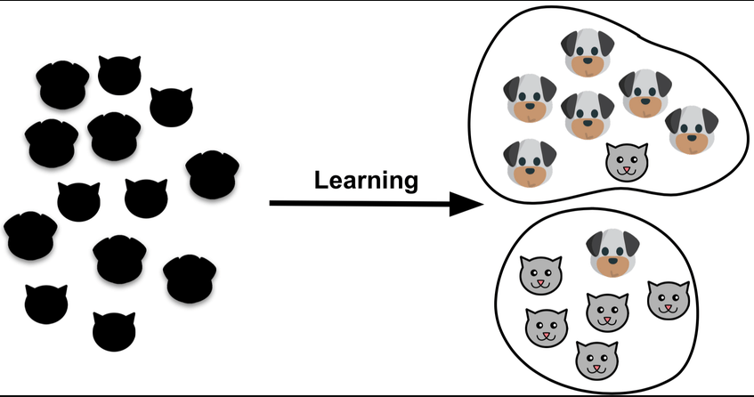
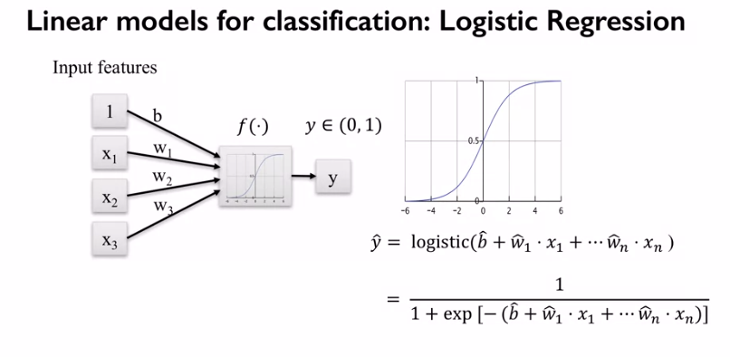
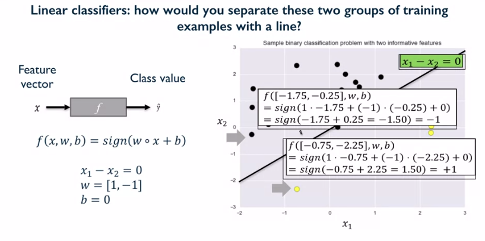
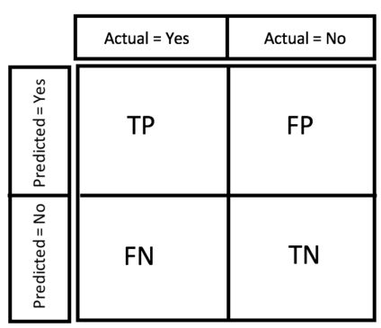
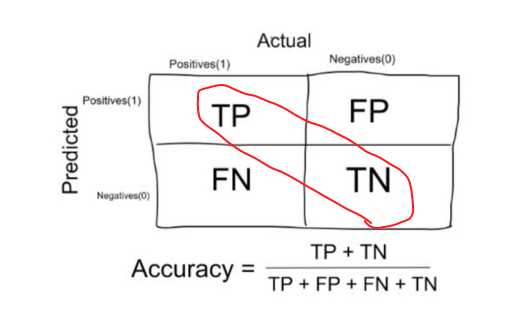
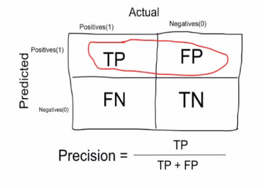
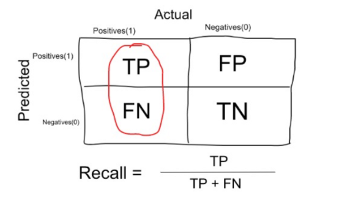
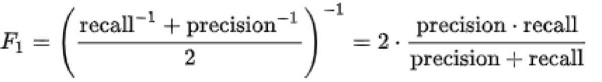

Binary classification and core concepts of it
^^^^^^^^^^^^^^^^^^^^^^^^^^^^^^^^^^^^^^^^^^^^^
The problem of classification is fundamental for the field of machine learning, as many amazing applications based on the concepts of it were constructed. As the regression, classification is a part of supervised learning. Unlike the regression models, classification ones output the probability of a sample's belong to one of N classes. Thus, we should know the exact number of classes before training the model. Some applications that rely on the classification techniques are the following : spam filters, fraud detection, object recognition, image classification, medical diagnostics, etc. Today we will speak about the binary classification, meaning that N=2 (where N is a number of classes). One thing to notice is that in classification, the classes' names are mapped to integers, thus if we have two classes, the first one will be mapped to 0, and the second one to 1.

One of the simplest examples for understanding classification and  not so easy to solve is to classify whether a dog or a cat is on image..

Differences between classification and regression
=================================================

The main thing is that the algorithms you already acquainted with, can be used for both regression and classification. However to use them for classification, some changes are needed. Firstly, instead of producing the discrete number our algorithms have to produce some sign/probability that the data point belongs to one of the predefined classes. This can be achivied by converting the linear output into the probability which varies in the interval from 0 to 1 (*sigmoid* function) and then use some threshold function to decide which class it corresponds to (that is how the *logistic regression* works). 

The other option is to use a sign function on the linear output which analog of threshold function (that is how the SVM for classification works).

The second thing we need to change is the loss function. The usual choice for binary classification is *binary cross entropy* or *hinge* (binary cross entropy is usually used for logistic regression, whereas hinge - for SVM) loss. 

.. note:: Understanding loss functions is out of scope of our introductory course, but we encourage you to visit `this <https://towardsdatascience.com/common-loss-functions-in-machine-learning-46af0ffc4d23>`_  resource to get more intuition about this theme. 

We won't consider changes in other algorithms as decision trees, random forest and so on, as these changes are minor. The main takeaway from it is that classification models produce a class label/probability. 

Classification metrics 
======================

Speaking about classification it's mandatory to understand the data and pick the right tool for performance measurement. First of all, let's speak about such metric as *accuracy*. Accuracy is usually used in classification models when we deal with balanced dataset, meaning that each class has the same number of data points. To undestand the metrics we will define next notations (all the metrics scores are in the interval from 0 to 1):

* TP - true positives, number of samples related to the first (positive) class that were predicted correctly.
* FP - false positives, number of samples related to the first (positive) class that were predicted incorrectly.
* TN - true negatives, number of samples related to the second (negative) class that were predicted correctly.
* FN - false negatives, number of samples related to the second (negative) class that were predicted incorrectly.

Accuracy is calculated in the following manner (number of all the correct predictions divided by the number of overall samples in the dataset):

It's preferred to use accuracy when dealing with balanced dataset, as if your dataset is imbalanced, the accuracy won't capture the real perfomance of the classifier. Suppose that you are to solve the next problem: 
There is some data coresponding to user activity, the abnormal user activity as watching videos 24/7 - coresponds to the fraud one. You for sure won't have balanced classes, as much more people will have non fraud activity. Thus, using accuracy as the main metric you might be reassured by its score, whereas in fact you classifier performs bad.

One solution to the highlited problem is to use such metrics as *precision*, *recall* and *f1 score*. 

Precision is calculated in the following manner (number of correct predictions for the first (positive) class divided by total number of data points corresponding to first (positive) class) :

Recall is calculated in the following manner (number of correct predictions for the first (positive) class divided by the sum of the previous value and number of inccorect predictions for the second (negative) class):

It is clear that recall gives us information about a classifier’s performance with respect to false negatives (how many did we miss), while precision gives us information about its performance with respect to false positives(how many did we caught). Thus, there is a kind of a trade off between precision and recall. As the result it's recommended to use the f1-score which is a harmonic mean of precision and recall.

F1 score is calculated in the following manner (harmonic mean of precision and recall) :

.. note:: In order to get more information and construct a much more robust intuition concerning metrics for classification please visit  `this <https://medium.com/@george.drakos62/how-to-select-the-right-evaluation-metric-for-machine-learning-models-part-3-classification-3eac420ec991?>`_  resource and `this <https://www.coursera.org/learn/python-machine-learning?>`_ course. 

Cross validation and greedy search
==================================

The last topic for today is about a new method of validating and evaluating the performance of our classifier. So far we validated our algorithm only on  a test set, which is actually just the portion of data that is randomly cut off our overall dataset. Actually this approach is bad as it relies on only one random subset of data, and it isn't enough to state that the algorithm is good or bad. Thus, for not very complicated classifiers and small-medium datasets the other approach named *cross validation is used*. 

Description of assignment
=========================
nothing for now 

.. image:: https://colab.research.google.com/assets/colab-badge.svg
  :target: https://colab.research.google.com/github/HikkaV/VNTU-ML-Courses/blob/master/assignments/machine_learning/assignment_1_classification/assignment_1.ipynb
  :width: 150
  :align: right
  :alt:  Assignment 1