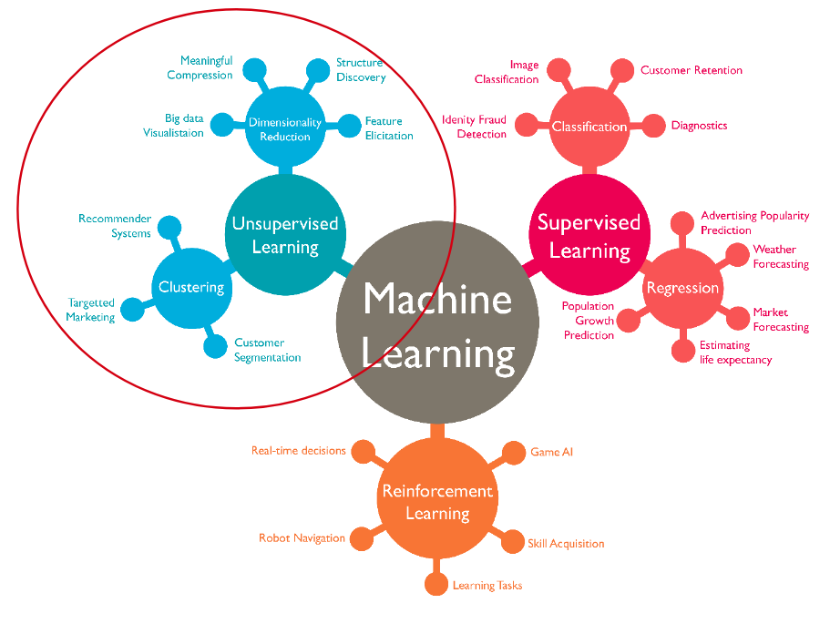
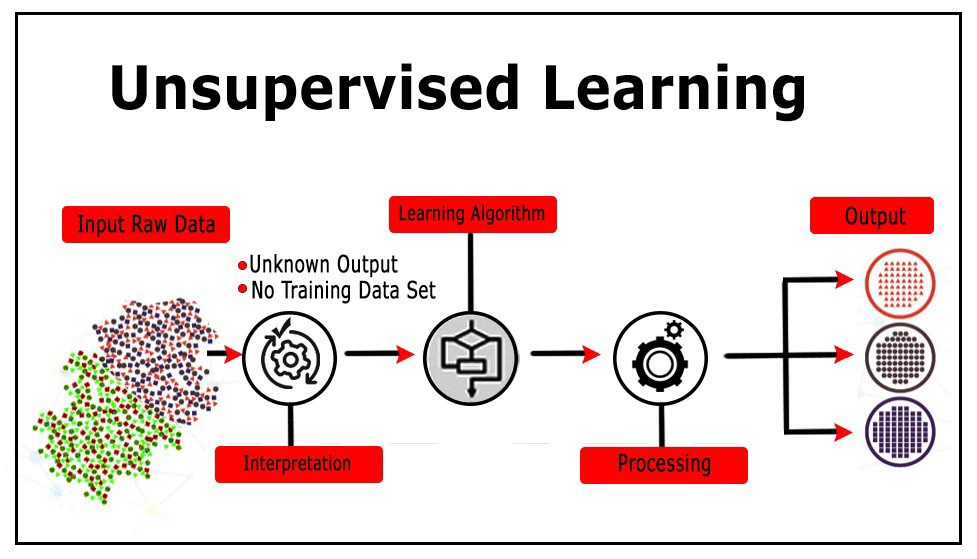
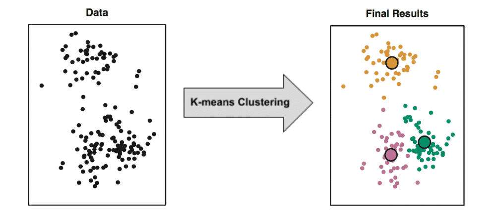
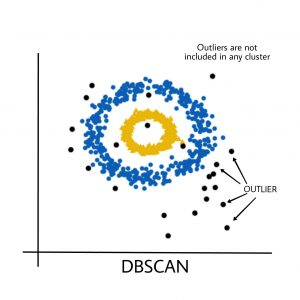

Clustering with unsupervised learning and key concepts of it
^^^^^^^^^^^^^^^^^^^^^^^^^^^^^^^^^^^^^^^^^^^^^^^^^^^^^^^^^^^^
Unsupervised learning techniques have many applications and in general can be divided into two groups by its usage : clustering and dimensionality reduction.

Some examples of applications based on unsupervised learning include clustering and grouping of users based on their profiles, data compression, visualization of high dimensional data and identifying withhold patterns in data. Unsupervised learning algorithms need only X (features) without y (labels) to work, as they tend to find similarities in data and based on them conduct clustering. 

One of the most simple and yet powerful algorithms of unsupervised learning is KMeans.

Understanding KMeans
====================
Objective of K-means is simple: group similar data points together and discover underlying patterns. To achieve this objective, K-means looks for a fixed number (k) of clusters in a dataset. The one should understand that *cluster* is just a collection of data points aggregated together because of certain similarities. k is a hyperparameter that should be set manually. k refers to the number of centroids you need in the dataset. A centroid is the imaginary or real location representing the center of the cluster. Thus k is the explicit number of clusters you want KMeans to group your data into. Every data point is allocated to each of the clusters through reducing the in-cluster sum of squares. In other words, the KMeans algorithm identifies k number of centroids, and then allocates every data point to the nearest cluster, while keeping the centroids as small as possible. 

A disadvantage of the algorithm is that the one needs to set the number of clusters (k) manually. However there is a technique called "elbow" method which can give an insight about the best number of clusters for your data. 

.. note:: You will get to know about "elbow" method in today's assignment.

Understanding DBSCAN
====================
DBSCAN is a clustering method that is used in machine learning to separate clusters of high density from clusters of low density. Given that DBSCAN is a density based clustering algorithm, it does a great job of seeking areas in the data that have a high density of observations, versus areas of the data that are not very dense with observations. DBSCAN can sort data into clusters of varying shapes and determine best number of clusters itself, which eliminates a need of setting it explicitly. DBSCAN firstly divides the dataset into n dimensions, then for each point in the dataset, DBSCAN forms an n dimensional shape around that data point, and counts how many data points fall within that shape. Finally, DBSCAN iteratively expands the cluster, by going through each individual point within the cluster, and counting the number of other data points nearby. 

.. note:: Many ideas were taken from `this <https://medium.com/@elutins/dbscan-what-is-it-when-to-use-it-how-to-use-it-8bd506293818>`_ article.

However, DBSCAN has some disadvantages :

* DBSCAN does not work well when dealing with clusters of varying densities.
* DBSCAN does not work well with high dimensional data.

Description of assignment
=========================
In today's assignment you will have a hands on introduction to clustering with KMeans and DBSCAN. You will learn how to apply the highlighted methods to group data into different clusters, understand "elbow" method and learn how to use it on practice, and grasp the advantages of DBSCAN. Have fun!

.. image:: https://colab.research.google.com/assets/colab-badge.svg
  :target: https://colab.research.google.com/github/HikkaV/DS-ML-Courses/blob/master/assignments/machine_learning/assignment_1_unsupervised/assignment_1.ipynb
  :width: 150
  :align: right
  :alt:  Assignment 1

