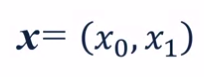
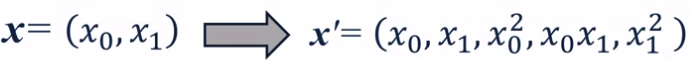
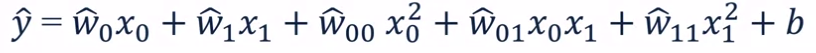
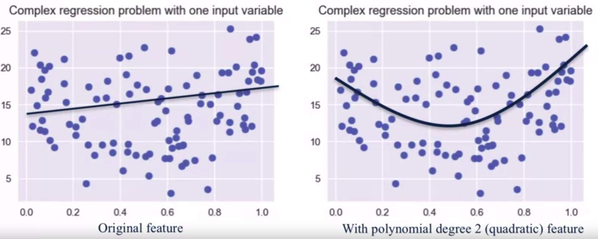

Polynomial regression
^^^^^^^^^^^^^^^^^^^^^

Key concepts of polynomial regression
=====================================

Recall that in the previous lesson we introduced you to linear regression classifier and used only two features to train the algorithm. Unfortunately, sometimes it's not enough to use only two features and the relationship between features and target can be not linear. In order to determine this relationship and understand the correlation between variables, people often use Pearson correlation coeficient which we have already introduced you in the data science section. Previously we used Pearson correlation only for two features (average number of rooms and weighted distances to five Boston employment centres) and we saw a positive score, meaning that those features have a forward correlation with target (price). But some features can also have the inverse correlation, meaning that when the feature value decreseas, the target value - increases and vice-versa. Sometimes due to complex relationships our features aren't linearly separable, thus we need a more complex function to fit the data. In this case the first thing to consider is polynomial regression. Polynomial regression is more about a sort of feature engineering than algorithm itself. Suppose that we have two feauteres, as represented on the inset below:

What we can do is  transform this features to polynomial ones:

Now we still need to predict a target, but instead of 2 features we will use 5. The critical insight here is that it's still a weighted linear combination of features, so it's still a linear model, that can use same least-squares estimation method for *w* and *b* (our parameters). The degree of polynomial specifies how many variables participate at time in each new feature (below example : degree 2).

So what really using polynomial features does is transforming our problem to a higher dimensional regression space. In effect adding these extra polynomial features allows us a much richer set of complex function that we can use to fit to the data. By using polynomial features we simply allow polynomials to be fit to the training data instead of a simply straight line, but using the same optimization algorithm that minimizes mse score. 

The one downside of this polynomial transformation is that polynomial feature expansion with high degree can lead to complex models that overfit, thus the polynomial regression is often combined with regularization methods like ridge regression (we will talk more about it in the third lesson).

.. note:: We badly encourage you to take a look on the `following <https://www.coursera.org/learn/python-machine-learning?>`_ course about using scikit-learn and other tools for applied machine learning. 

Description of assignment
=========================
In this assignment you will continue working with linear regression, but using all the features. First of all you will make a more complex data analysis to understand the dependencies between different features and target. Then you will fit a linear regression on all the features + transform them to polynomials in order to use polynomial regression. Finally, you will compare the results with the ones you obtained previously.  

.. image:: https://colab.research.google.com/assets/colab-badge.svg
  :target: https://colab.research.google.com/github/HikkaV/VNTU-ML-Courses/blob/master/assignments/machine_learning/assignment_2/assignment_2.ipynb
  :width: 150
  :align: right
  :alt:  Assignment 2