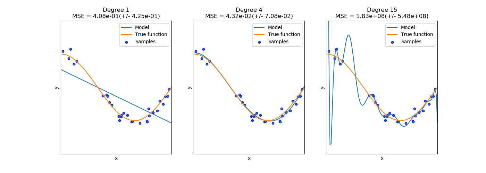
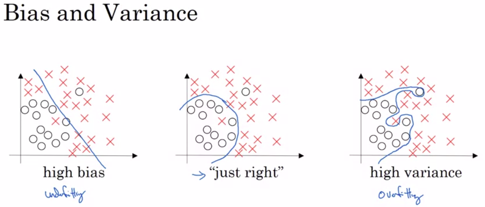
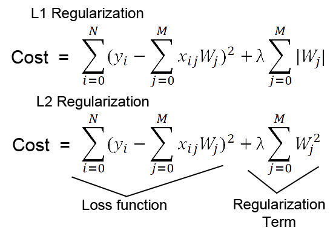

l1 and l2 regularization
^^^^^^^^^^^^^^^^^^^^^^^^

Overfitting problem
===================

In the previous lesson you were introduced to polynomial regression model. Despite the fact that this classifier did much better on both train and test data than the linear regression, we see a gap between its performance on train and test data. Actually, the mse score on train data was lower than on test one, which is a sign of *overfitting* to train data. Overfitting is a most frequently encountered problem in the supervised learning, that means that the model has a poor generalization towards new data. Overfitting occurs when our model learns very complex function in order to exactly *fit* all the data in training subset. Let's consider the following example : You want to train your model to classify if the object is shoes, but the only images you have in our training data - are the photos of sneakers. Thus, when your model sees boots, it will think that it's not shoes which is actually incorrect. One problem that can lead to overfitting,as defined in the highlighted example, is the imbalanced dataset (when there are more samples in one class than in the other) or different distribution of data. Coming back to our problem, we experience overfitting because of the complexity of the decision boundary that was learned by our  algorithm. The chart shown below describes the decision boundary of polynomial regression depending on different degree of polynomial.

Note how the decision boundary changes with complexity of the model (with increasing the degree of polynom). Overfitting is a fundamental problem, as the only thing we are interested in - perfomance of the model on unseen data. Overfitting is often referred to as the problem of high variance.

Underfitting problem
====================

| Along with overfitting exists the problem of *underfitting*. Underfitting refers to the problem of *a bad fit to the data* often referred to as high bias, that implies that our classifier is too simple to solve our task. In order to understand the trade off between overfitting and underfitting let's consider the chart shown below.

| Actually, your classifier can encounter both problems at the same time. 

.. note:: We badly encourage you to take a look on `this <https://www.coursera.org/learn/deep-neural-network?>`_ course by Andrew Ng to get more information about bias-variance trade off.

Regularization
==============

| One solution to overfitting is called regularization. There are many types of regularization, but today we gonna focus on *l1 and l2 regularization* techniques.  Actually l1 and l2 are the norms of matrices. In our case they are norms of weights' matrix that are added to our loss function, like on the inset below.

| L1 and l2 are often referred to as penalty that is applied to loss function. What the regularization does is making our classifier simpler to increase the generalization abilitty. Parameter alpha in the chart above is hyper parameter which is set manually, the gist of which is the power of regularization, the bigger alpha is - the more regularization will be applied and vice-versa. Regression that uses l1 regularization is called Lasso regression and the one that uses l2 - Ridge. Regularization is a key technique to solve overfitting.

Feature normalization
=====================

| We have already introduced you to data scaling in the description of the first assignment, but so far we haven't used it at all. In this assignment you will perform feature normalization in order to speed up the training of your classifier and get much better results, but before let's define some rules of using feature scaling and normalization.

* Fit the scaler using the training set, then apply the same scaler to transform the test set.
* Do not scale the training and test sets using different scalers : this could lead to random skew in data.
* Do not fit the scaler using any part of the test data: referencing the test data can lead to a form of data leakage.

| Feature normalization is mandatory preprocessing step and we will use it further in this course.

Description of assignment
=========================

| In today's assignment you will use l1 and l2 regularization to solve the problem of overfitting. You will firstly scale you data using MinMaxScaler, then train linear regression with both l1 and l2 regularization on the scaled data and finally perform regularization on the polynomial regression. 

.. image:: https://colab.research.google.com/assets/colab-badge.svg
  :target: https://colab.research.google.com/github/HikkaV/VNTU-ML-Courses/blob/master/assignments/machine_learning/assignment_3_regression/assignment_3.ipynb
  :width: 150
  :align: right
  :alt:  Assignment 3

