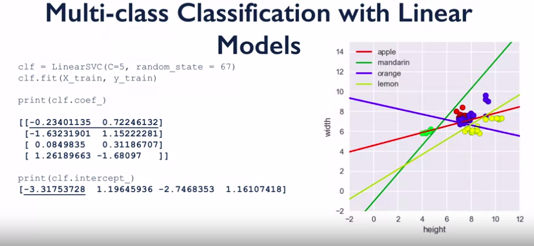
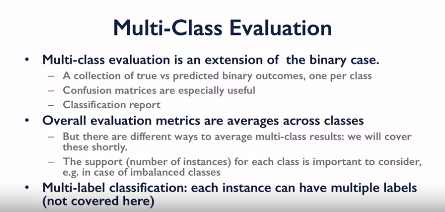

Multiclassification
^^^^^^^^^^^^^^^^^^^
In a real world, not all the problems are binary and the target is a categorical one. Thus, we need to understand what changes are needed to make our model appropriate for multiclassification. What we can do is convert our multiclassification problem into the chain of binary ones, by training a bunch of classifiers that predict one class against all the other classes, where number of classifiers equals number of classes.

Actually, that's not the best solution for big complex datasets and sophisticated models. However there is a solution of using a *softmax* function with loss function known as *categorical cross entropy*. It's out of scope of our course, but you can learn about it in this `course <https://www.coursera.org/learn/machine-learning/>`_.

In order to calculate metrics for multiclassification we need to apply the next changes :

While working with multiclassification, sometimes it's useful to examine the decision boundaries of the classifier, as it gives and idea of how our model separates different data instances. But if we work with high dimensional data, we can't simply visualize it in a human friendly manner. Thus, we need to reduce the dimension of our data to 2d or 3d. For this purposes *unsupervised learning* methods are used. However, :doc:`unsupervised learning <unsupervised>` is the other part of the course, we will use its algorithm called *PCA* to achieve the exposed goal.  

Description of assignment
=========================
In your last assignment in classification section you will explore multiclassification with NIST handwritten digit dataset and visualize the decision boundaries of logistic regression model. We hope that this section was useful to you and you will continue exploring machine learning sphere further.

.. image:: https://colab.research.google.com/assets/colab-badge.svg
  :target: https://colab.research.google.com/github/HikkaV/VNTU-ML-Courses/blob/master/assignments/machine_learning/assignment_3_classification/assignment_3.ipynb
  :width: 150
  :align: right
  :alt:  Assignment 3

| In order to check the gained knowledge, please carry on with the quiz related to this lesson.

|