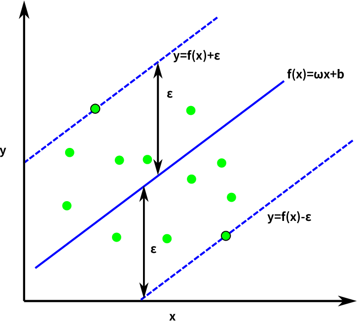
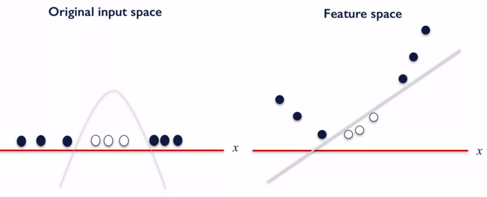
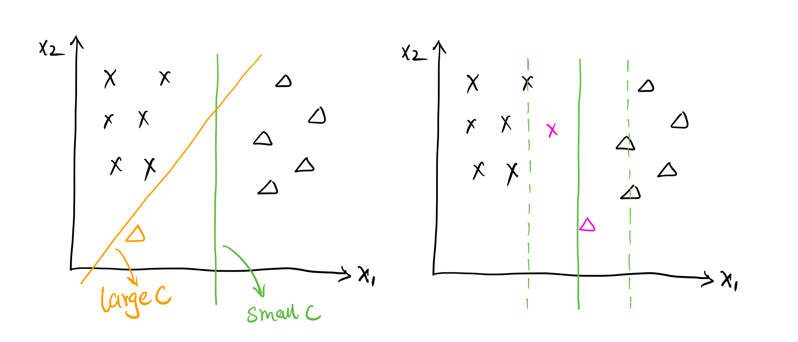

SVM (Support Vector Machines)
^^^^^^^^^^^^^^^^^^^^^^^^^^^^^

The gist of SVM
===============

| Today we will introduce you to Support Vector Machines classifier. SVM is often referred to as maximum margin classifier. What does the classifier margin mean? Margin is defined as the maximum width the decision boundary area can be increased before hitting a data point. The linear classifier with maximum margin is a linear Support Vector Machine (LSVM). The formula that describes the decision boundary of linear SVM regression is the following (where epsilon denotes the width of margin) : 

| There is an other type of SVM algorithm known as Kernelized SVM. Kernel is just a similarity measure (modified dot product) between data points. What it really does is transforming features to the other space in order them to be easy fit by a linear classifier (see the example shown below).

This kind of transformation resembles the polynomial transformation that was used earlier for linear regression, and frankly speaking the polynomial kernel function for SVM exists. There are different kernel functions, but the main thing about them is that they can transform original input space to the feature space in which features are linear separable.  

.. note:: We won't dig deep into the math of SVM, but we badly encourage you to take a look on `this <https://www.coursera.org/learn/machine-learning?>`_ course made by Andrew Ng. 

Handling Overfitting
====================

The strength of regularization in SVM is determined by C parameter. Larger values of C - less regularization, smaller - more. There is also the parameter named gamma which is applied in kernel function and is responsible for the smoothness of decision boundaries. Smaller gamma results in more points grouped together and smoother decision boundaries, larger values of gamma results in more complex decision boundary. Both parameters affect the regularization and should be chosen correctly. 

Description of assignment
=========================

In today's assignment you will work with SVM regressor. You will have a chance to try different kinds of kernel functions, values of C and gamma and compare the results with the previous ones. 

.. image:: https://colab.research.google.com/assets/colab-badge.svg
  :target: https://colab.research.google.com/github/HikkaV/VNTU-ML-Courses/blob/master/assignments/machine_learning/assignment_4_regression/assignment_4.ipynb
  :width: 150
  :align: right
  :alt:  Assignment 4

