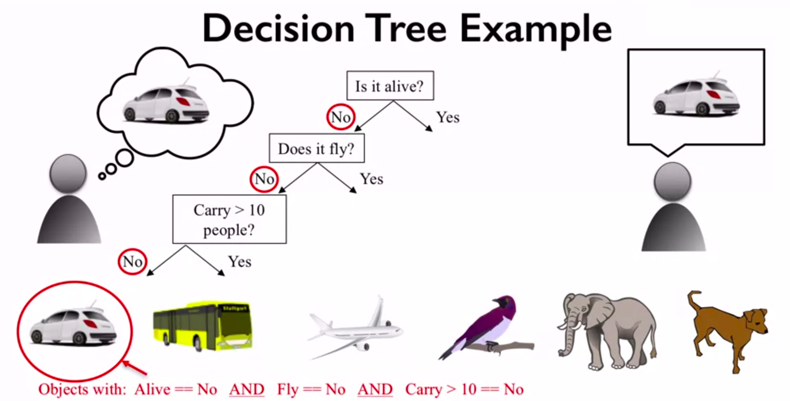
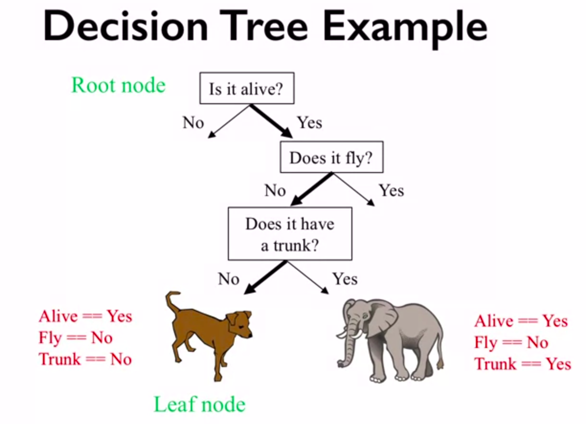
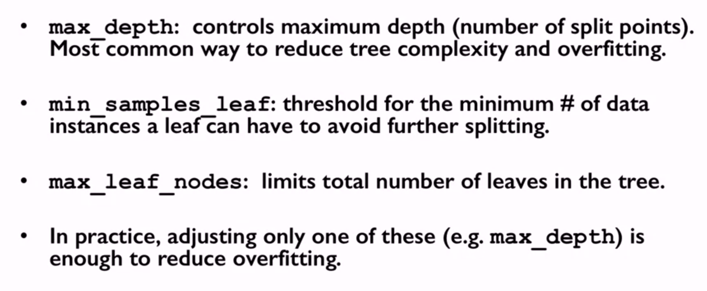
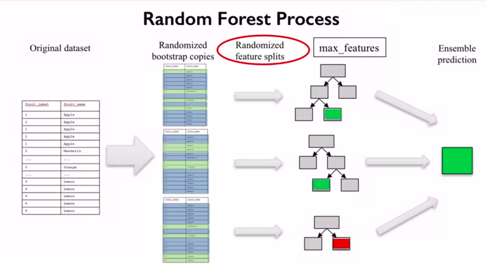
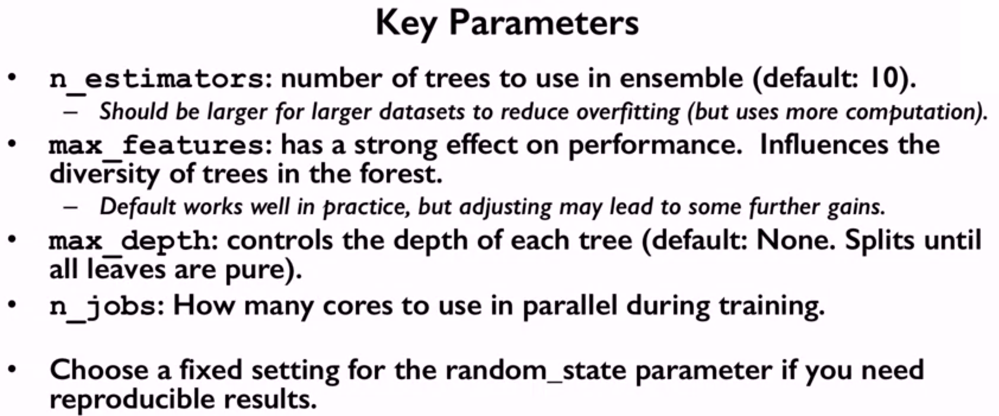
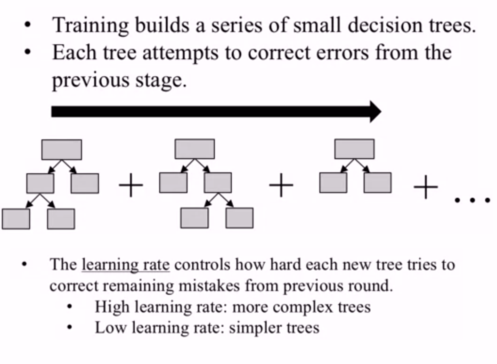
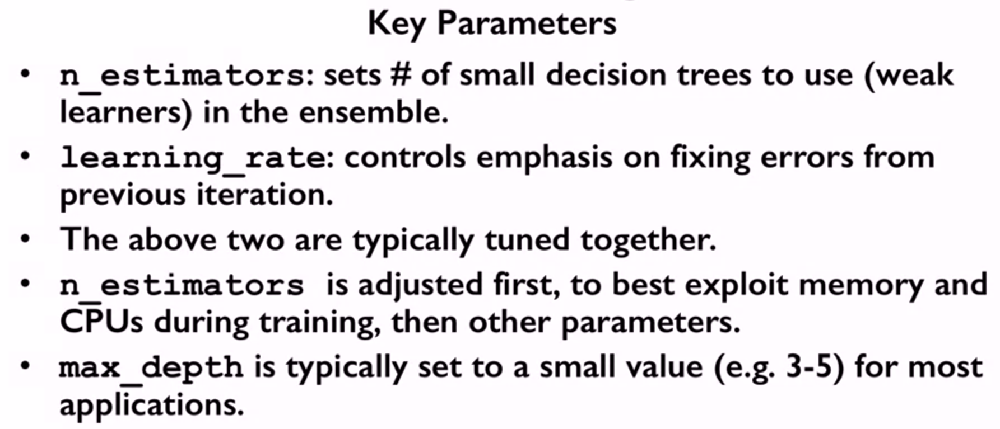

Decision trees family
^^^^^^^^^^^^^^^^^^^^^

Decision trees
==============

Decision trees are a popular supervised machine learning method that can be used for both regression and classification. Decision trees are easy to use and interpret, thus this method can help to understand what features are the most influential in the dataset. Basically, decision trees learn a series of explicit if then rules on feature values that result in a decision that predicts the target value. The simple example is shown below.

The inset above shows the example of rules (questions) the decision tree learned to classify the objects based on their features. The questions learned by the algorithm produces a tree with different branches based on the related answers (yes/no).

There are different parameters that are used to control the complexity of tree like max_depth, max_leaf_nodes, min_samples_leaf and so on (you will see the effect of these parameters in the today's assignment). Thus by tunning them the one can reduce overfitting. The one key feature of decision trees is that they don't require specific scaling and normalization of data. The key parameters of decision tree is shown below.

Random forest
=============

If we think about decision tree as about human, then the forest is a big amount of people with different opinions. In real life if the opinion of a big part of people about some thing  agree, then there is a big probability that this opinion is a true one, that's the key idea behind random forest. Random forest is an ensemble of learning models. An ensemble takes multiple individual learning models and combines them to produce an aggregate model that is more powerful than any of its individual learning models alone. By combining different individual models into an ensemble, we can average out their individual mistakes to reduce the risk of overfitting while maintaining strong prediction performance. Each tree in random forest is built from the random sample of the data. There are some hyperparameters we need to choose for random forest classifier as number of trees, the number of features to consider when looking for the best split, etc.

The prediction using random forest is conducted in the following way:

* Make prediction for every tree in the forest.
* Combine individual predictions (for regression : mean of individual treee predictions)

Unlike the decision tree, random forest is hard to interpret. The key parameters of random forest are shown below.

GBDT (Gradient Boosted Decision Trees)
======================================

Like a random forest, GBDT uses an ensemble of decision trees to solve both regression and classification models. The key idea of GBDT is that it creates a series of trees, where each tree is trained that it attempts to correct the mistakes of the previous tree in the series. 

GBDT often have a much higher perfomance than other decision tree based algorithms. The key parameters of GBDT are shown below.

.. note:: Many ideas represented on this page were taken from `this <https://www.coursera.org/learn/python-machine-learning?>`_ course. 

Description of assignment
=========================

In today's assignment you will work with the models from decision trees family. You will use all the highlited algorithms to solve the problem of predicting housing prices. Note that this is the last assignment in regression module. We hope that this section was useful to you and you will continue exploring machine learning sphere further.

.. image:: https://colab.research.google.com/assets/colab-badge.svg
  :target: https://colab.research.google.com/github/HikkaV/VNTU-ML-Courses/blob/master/assignments/machine_learning/assignment_5_regression/assignment_5.ipynb
  :width: 150
  :align: right
  :alt:  Assignment 5