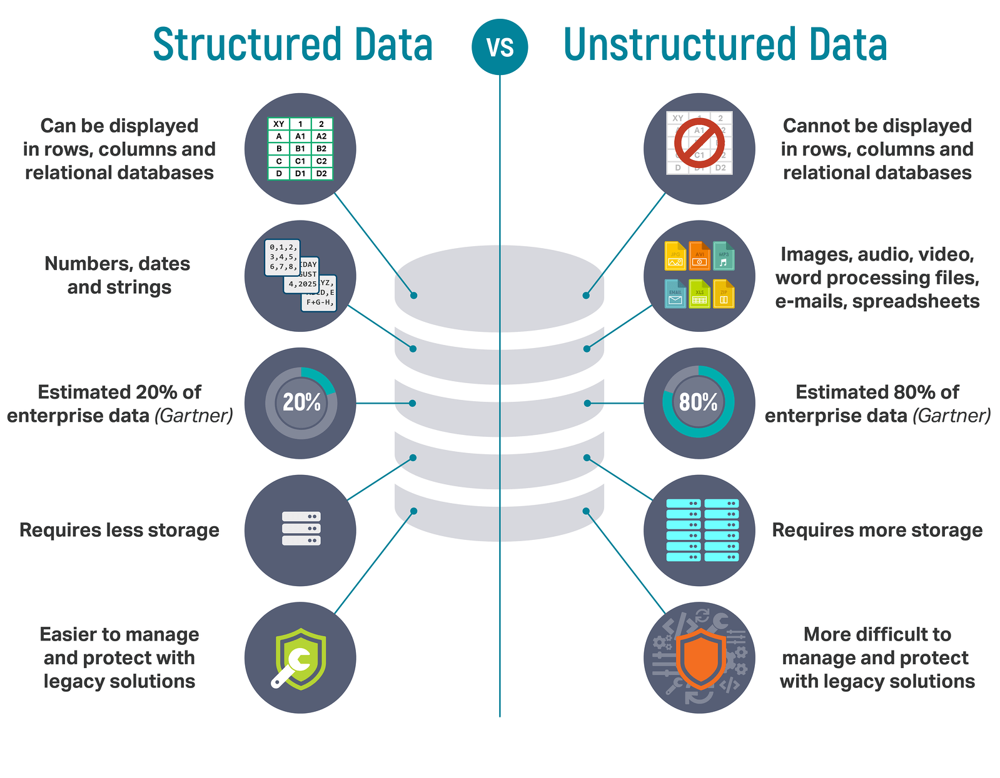

Getting and cleanning data
^^^^^^^^^^^^^^^^^^^^^^^^^^

One can admit that term Data Science consinst of 2 words: "Data" and "Science". It's not a coincidence, thus in this part we will focus on first part - "Data".
In the present times we can found data literally everywhere: from text messages on our phones to whether predictions on TV in different forms and presentations (video, audio, text, images, etc...). Data could be break into two subcategories shown below.

| Comparison of structured and unstructured data :

A lot of data analysis time is spent on data cleaning and data preparation, up to 80% of the time. And here for the rescue comes term `Tidy Data`. Idea behind tidy data is taken from relational databases and database normalization from computer science. Beside rows and columns in tables, additional point should be considered:

- The data is a collection of values of a given type
- Every value belongs to a variable
- Every variable belongs to an observation
- Observations are variables for a unit (like an object or an event).

The objective of tidy data is to map the meaning of the data (semantics) onto the structure of the data.

However, many real world data sets violate the principle of tidy data. Here is 5 common problems:

- Column headers are values, not variable names
- Multiple variables are stored in one column
- Variables are stored in both rows and columns
- Multiple types of observational units are stored in the same table
- A single observational unit is stored in multiple tables

It is only after data is tidy that it is useful for data analysis.

Other areas out side of tidy data include parsing variable types (dates and numbers), dealing with missing values, characters encodings, typos and outliers.

In first assignment we will work through process of dates parsing. And see how dataset is valuable to data issues.

.. note:: Some information is taken from `this <https://vita.had.co.nz/papers/tidy-data.pdf>`_ article.

.. image:: https://colab.research.google.com/assets/colab-badge.svg
  :target: https://colab.research.google.com/github/HikkaV/VNTU-ML-Courses/blob/master/assignments/data_science/assignment_1_getting_and_cleanning_data/assignment_1_getting_and_cleanning_data/parsing_dates.ipynb
  :width: 150
  :align: right
  :alt:  Assignment 1