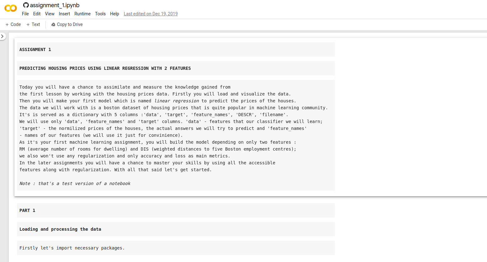
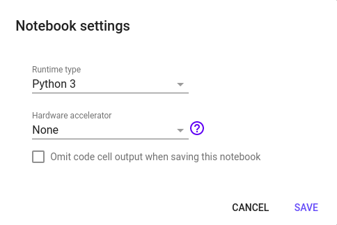
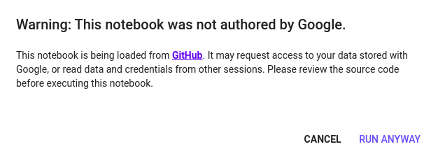
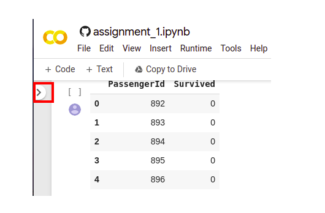
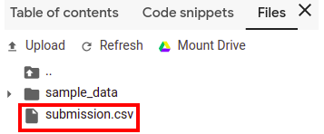

How to start with Google Colaboratory
^^^^^^^^^^^^^^^^^^^^^^^^^^^^^^^^^^^^^

For all the laboratories and assignments in this course, the google colaboratory is used. In order to undestand key features of it, please follow  `this <https://colab.research.google.com/notebooks/basic_features_overview.ipynb>`_ tutorial. 

At the end of each lesson you will see the following button :

.. image:: https://colab.research.google.com/assets/colab-badge.svg
  :width: 150
  :align: center

| |
By pressing on it you'll be redirected to the related assignment :

In the google colab you can change the code as you want, you can add cells, write your own functions, etc, as all the notebooks for assignments are in playground mode. You can also choose the runtime type (it's beneficial while working with deep learning models) :

Note, that you don't need to install any packages, as they are already installed in colab environment. If you want to run all the code on your own machine, please go to this :doc:`section <faq>`. 

When you start runnig the cells, you will probably see this message :

Just press `RUN ANYWAY` and go on with a notebook.

Loading from colab
==================

In classification module you will try to solve the challenge from `kaggle <https://www.kaggle.com/>`_, as the result the file with submission will be saved locally in colab. In order to load it to your machine and then submit on the page of compettion, do the following :

* Open the dropout menu :

* Choose Files and download a submission.csv file :

Colab is a powerful tool for working with notebooks, making research and analysis of data, because of that it will be used heavily throught the course.