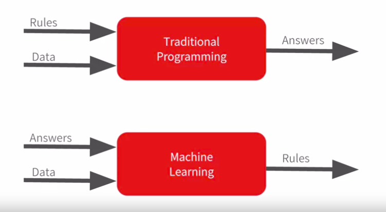
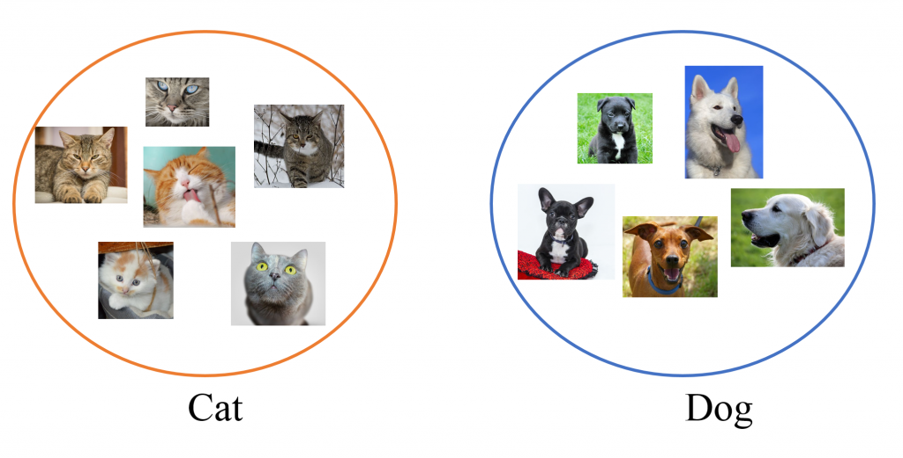
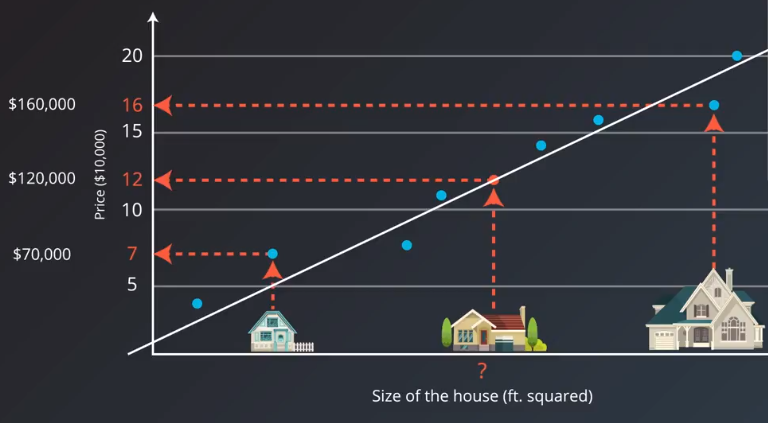

Description
===========

In this section you will get to know the key notions that will be used throught the course.

Machine learning
^^^^^^^^^^^^^^^^

**Machine learning** - is a branch of AI (`Artificial Intellegence`) in programming the main goal of which is to make the machine "learn" how to solve the tasks which can't be programmed explicitly. Nowadays, Machine learning is a really hot topic, as the applications of this sphere extended broadly. For instance let's consider the contemporary smartphone : such functions as voice assistant, fingerprint and face verification, handwritten recognition are included in it, and all of the highlited functions are machine learning driven. Actually, to understand the main difference between machine learning and ordinary programming we can expose the following example :

| Let's say we need to make a programm that should predict the price of the house depending on the number of its rooms (`the example is simplified`). We can try to solve this programm without using any machine learning techniques, just by writing some if else rules. But as the data grows it will become harder and harder to code all the rules to obtain an expected results. A much smarter solution is to train a machine learing algorithm that will find the dependency between price and number of rooms and then create the rules itself (`the current example is related to supervised learning`)

| The picture describing this main difference is pinned below.

 
The are three main types of learning : 
 
 * *Supervised learning*
 * *Unsupervised learning*
 * *Reinforcement learning*

 .. note:: We won't consider the Reinforcement learning in this course, but you can find additional information about it `here <https://www.geeksforgeeks.org/what-is-reinforcement-learning/>`_. Instead we will mainly focus on "clasical machine learning".

.. image:: classical_ml.jpg
  :width: 800
  :alt: The tree of classical machine learning

*Supervised learning* - is a type of machine learning, when given a data/features  (by notation `X`) and coressponding answers/labels (by notation `Y`) an algorithm learns a complex function to map data/features to answers/labels. There are lots of useful application concerning supervised learning, for instance : image classification, fraud detection, object recognition, face varification, weather forecast, etc. The supervised learning is divided into two types of problems : *regresion* and *classification*.  

| In *classification* problem the answer (`sometimes called the target, we will use this name further`) is a categorical label/class and the task of the algorithm (`sometimes called the classifier or the model`) is to classify the sample/object depending on the features of relevant data.  In order to understand the it better, let's say you encountered the following problem : you have pictures of cats and dogs and you should determine whether the picture contains dog or cat. That's a routine task of image classification.

| On contrary the problem of *regression* exists, in which the target is a discrete continuous number and the task of a model is to learn the dependencies between features and the target to output the value that is the nearest to the target one. Simple example of regression is the task of predicting houses' prices depending on the number of rooms/size of the house. Instead of classifying houses into different groups, what we really want is to predict its exact price, that is actually a continuos number.

| You will have a chance to work with both classification and regression tasks in the first module of Machine Learning course. 

