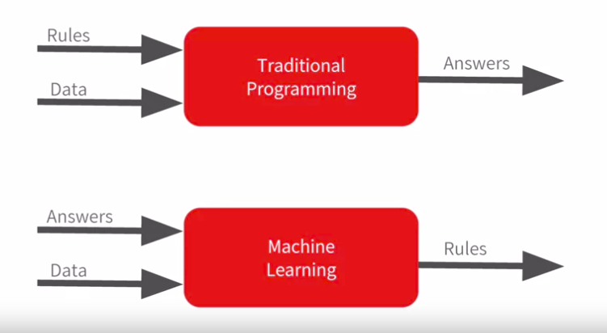
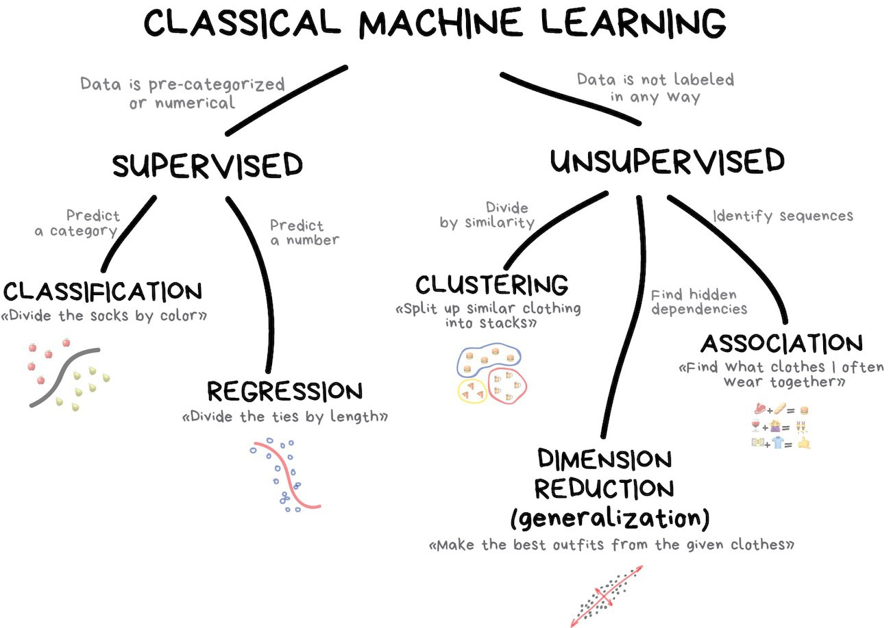
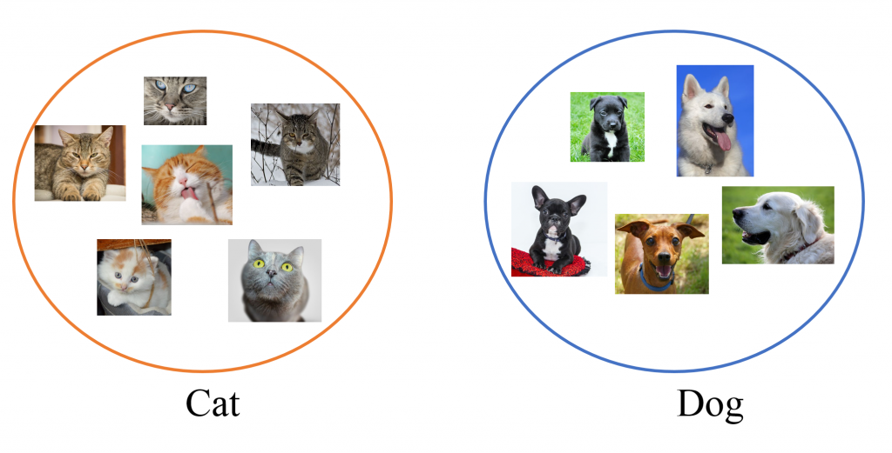
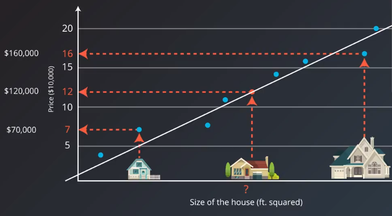
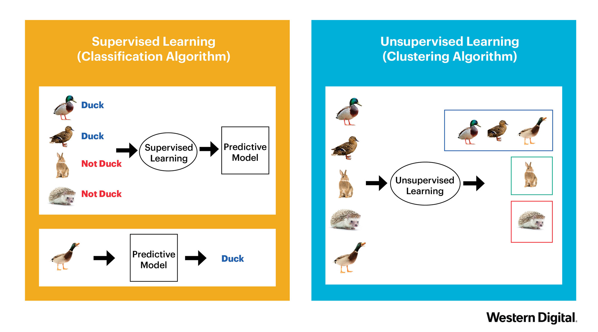

Description
===========

In this section you will get to know the key notions that will be used throught the course.

Data science
^^^^^^^^^^^^
Data science - is a field that uses scientific methods, processes, algorithms and systems to extract knowledge and insights from structered and unstructered data. Data science is a field that combines statistics, data analysis and machine learning to understand and analyse the data. Nowadays data science is one of the most demanding professions in sphere of IT, as the contemporary world is a data driven one. The main duties of every data scientists include : analysis of data, it's preprocessing, cleaning and transformation and finally extracting sense from it using statistical and machine learning techniques. As the core of data science is statistics and mathematics, the related part of the course is focused on teaching how to apply the techniques of highlited spheres to solve real world problems.

.. image:: images/datascience.png
  :width: 800
  :alt: Data scinece

Machine learning
^^^^^^^^^^^^^^^^

**Machine learning** - is a branch of AI (`Artificial Intellegence`) in programming the main goal of which is to make the machine "learn" how to solve the tasks which can't be programmed explicitly. Nowadays, Machine learning is a really hot topic, as the applications of this sphere extended broadly. For instance let's consider the contemporary smartphone : such functions as voice assistant, fingerprint and face verification, handwritten recognition are included in it, and all of the highlited functions are machine learning driven. Actually, to understand the main difference between machine learning and ordinary programming we can expose the following example :

| Let's say we need to make a programm that should predict the price of the house depending on the number of its rooms (`the example is simplified`). We can try to solve this programm without using any machine learning techniques, just by writing some if else rules. But as the data grows it will become harder and harder to code all the rules to obtain an expected results. A much smarter solution is to train a machine learing algorithm that will find the dependency between price and number of rooms and then create the rules itself (`the current example is related to supervised learning`)

| The picture describing this main difference is pinned below.

 
The are three main types of learning : 
 
 * *Supervised learning*
 * *Unsupervised learning*
 * *Reinforcement learning*

 .. note:: We won't consider the Reinforcement learning in this course, but you can find additional information about it `here <https://www.geeksforgeeks.org/what-is-reinforcement-learning/>`_. Instead we will mainly focus on "clasical machine learning".

*Supervised learning* - is a type of machine learning, when given a data/features  (by notation `X`) and coressponding answers/labels (by notation `Y`) an algorithm learns a complex function to map data/features to answers/labels. There are lots of useful application concerning supervised learning, for instance : image classification, fraud detection, object recognition, face varification, weather forecast, etc. The supervised learning is divided into two types of problems : *regresion* and *classification*.  

| In *classification* problem the answer (`sometimes called the target, we will use this name further`) is a categorical label/class and the task of the algorithm (`sometimes called the classifier or the model`) is to classify the sample/object depending on the features of relevant data.  In order to understand the it better, let's say you encountered the following problem : you have pictures of cats and dogs and you should determine whether the picture contains dog or cat. That's a routine task of image classification.

| On contrary the problem of *regression* exists, in which the target is a discrete continuous number and the task of a model is to learn the dependencies between features and the target to output the value that is the nearest to the target one. Simple example of regression is the task of predicting houses' prices depending on the number of rooms/size of the house. Instead of classifying houses into different groups, what we really want is to predict its exact price, that is actually a continuos number.

*Unsupervised learning* - is a type of learning when algorithm is given only data/features without any answers/labels. The purpose of unsupervised learning alogirthms is to find the similarities between data samples and based on this similarities perform some actions. The unsupervised learning is divided into three types of problems : *clustering* , *dimension reduction* , *association*.

 .. note:: We will focus only on *clustering* as the other algorithms are outofscope this course, but we encourage you to visit this `page <https://algorithmia.com/blog/introduction-to-unsupervised-learning>`_ to get more information.

| In *clustering* problem the goal of the algorithm is to cluster the data into different groups based on the similarities between samples. To understand the gist of clustering let's define the following problem : you need to make a system that identifies spam messages and sends them to spam folder. What you can do is gether the information like words from the messages and the cluster these information into two different groups, after that you can determine yourself which group contains spam and which - not.

To undestand the difference between supervised and usupervised learning let's consider the following pictures which shows the difference between classsification (supervised learning) and clustering (unsupervised learning) :

| You will have a chance to work with both supervised and unsupervised learning techniques and dig deeper into core concepts of machine learning further in this course. 

Python
^^^^^^

Why use Python for machine learning and data science stuff? The answer is pretty obvious, because it's much simpler, much faster and finally much more efficient to do this heavy job using the exposed programming language. Python scientific packages such as scipy, numpy, pandas and others allow conducting complex mathematics computations and statistics calculus in few lines of code giving analysts and researchers a possibility to easily make analysis and developing new algorithms. What is more, Python is usually used in production solutions, thus you can easily refactor your draft code for (let's say) processing of the data  and then scale it up to production system.

Despite the fact that in this course you won't write the production ready code, you will get to know how to use Python for basic analysis and machine learning that will give you the mandatory skills to continue learning and developing in data sciense area. Finally, to persuade you in the fact that Python is the language you should really use, let's look at the chart showing the popularity of languages for the current year : 

.. image:: images/lan_comparision.jpg
  :width: 800
  :alt: Language comparision for 2019

Based on the diagram shown below, Python is the most popular language at the moment, just analytics, nothing personal.

